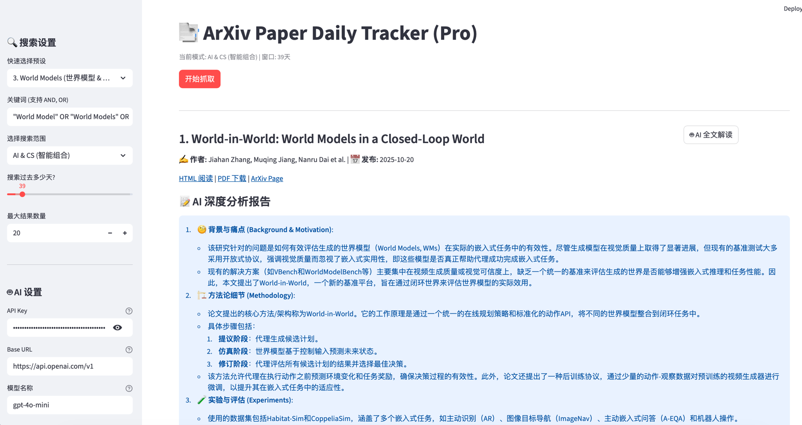

# 📑 ArXiv 智能论文追踪与深度阅读助手

> Your Personal AI Research Assistant.
>
> 一个基于 Python Streamlit 的全栈科研工具。不仅仅是搜索，更能阅读全文。专为解决“信息过载”和“读论文太慢”而生。




## 📖 简介 (Introduction)

本工具旨在帮助科研人员高效筛选并精读每日新论文。

它不仅仅是一个搜索聚合器，更是一个**AI 阅读器**。它能自动解析 ArXiv 的 HTML 或 PDF 版本，提取正文内容，并利用 LLM (GPT-4o/DeepSeek) 进行深度剖析，从背景痛点到实验数据，一览无余。


### 🔥 最新动态 (News)
* [New] 🏷️ 标签与笔记系统：收藏夹再次进化！现在你可以为收藏的论文打上多重标签（如 LLM, Must Read）并撰写个人笔记。支持按标签快速筛选，打造你的专属科研第二大脑。
* [New] ⭐ 上线收藏夹功能**：现在你可以点击 ❤️ 将心仪的论文一键保存到本地。构建属于你的个人论文知识库，支持随时回看，并在收藏夹中直接调用 AI 进行全文解读，再也不用担心搜过的论文找不到了！

## ✨ 核心特性 (Key Features)

### 1. 🧠 AI 全文深度解读 (Full-Text Analysis)

不再局限于摘要！本工具具备**HTML/PDF 双模解析能力**：

- **HTML 优先 (极速)**：自动检测并抓取 ArXiv HTML 版本，去除参考文献和导航，秒级获取纯净正文。
- **PDF 兜底**：如果没有 HTML，自动下载 PDF 并提取前 N 页核心内容。
- **5维深度报告**：AI 会阅读正文并回答：
  1. 🧐 **背景与痛点** (SOTA 的局限性是什么？)
  2. 🏗️ **方法论细节** (具体的架构、Loss 函数设计)
  3. 🧪 **实验与评估** (数据集、Baseline、具体提升数值)
  4. 🤔 **优势与局限** (Pros & Cons)
  5. 💡 **总结与启发**

### 2. 🔍 智能搜索策略

- **宽进严出 (Broad Entry, Strict Exit)**：向 API 请求 5 倍数据量并强制按**相关性**排序，再在本地进行**时间过滤**。解决“按时间搜不准，按相关性搜太旧”的难题。
- **专家级预设 (Expert Presets)**：
  - `AI + Economics`: 包含 Mechanism Design, Game Theory 等硬核关键词。
  - `Agents`: 覆盖 LLM Agent, RL Agent, Multi-Agent 及 Cooperative AI。
  - `World Models`: 包含 MBRL, Generative World Model 等。

### 3. 🛡️ 安全与便捷

- **环境变量支持**：支持从系统环境变量自动读取 `OPENAI_API_KEY`，无需每次手动输入。
- **模块化架构**：代码拆分为 API、阅读器、AI Agent 等独立模块，易于维护和二次开发。

## 🛠️ 快速开始 (Quick Start)

### 1. 环境准备

```
# 克隆项目
git clone https://github.com/Miracle1207/arxiv-daily-tracker.git
cd arxiv-daily-tracker

# 安装依赖
pip install -r requirements.txt
```

### 2. 配置 API Key (推荐)

为了安全和便捷，建议将 API Key 设置为环境变量。

**MacOS / Linux:**

```
export OPENAI_API_KEY="sk-你的密钥"
```

**Windows (PowerShell):**

```
$env:OPENAI_API_KEY="sk-你的密钥"
```

*注：你也可以直接在网页侧边栏手动输入 Key。*

### 3. 运行应用

```
streamlit run app.py
```

浏览器将自动打开 `http://localhost:8501`。

## 📂 项目结构 (Project Structure)

```
.
├── app.py             # 主程序入口 (UI 逻辑与调度)
├── arxiv_api.py       # 搜索模块 (负责与 ArXiv API 交互、清洗数据)
├── paper_reader.py    # 阅读模块 (核心：HTML解析 + PDF下载降级策略)
├── ai_agent.py        # AI 模块 (Prompt 工程、LLM 调用)
├── utils.py           # 工具模块 (常量定义、查询构建、导出功能)
├── requirements.txt   # 依赖列表
└── README.md          # 说明文档
```

## 💡 使用技巧 (Tips)

1. **关于模型选择**：
   - 推荐使用 **`gpt-4o-mini`** 或 **`deepseek-chat`**。
   - 因为全文阅读会消耗较多 Token（每篇约 3k-8k tokens），这两个模型在长文本处理能力和性价比上是最佳选择。
2. **关于 Base URL**：
   - 如果你在国内且使用 OpenAI 官方 Key，请填写中转商地址。
   - 如果你使用 DeepSeek，请填 `https://api.deepseek.com`。
3. **HTML vs PDF**：
   - 工具默认优先尝试 HTML（速度极快）。点击“AI 全文解读”后，请留意状态提示：`✅ 获取成功 (HTML)` 代表极速体验，`✅ 获取成功 (PDF)` 代表下载了解析版。

## 🤝 贡献 (Contributing)

欢迎提交 PR 改进 Prompt 或增加新的领域预设！
